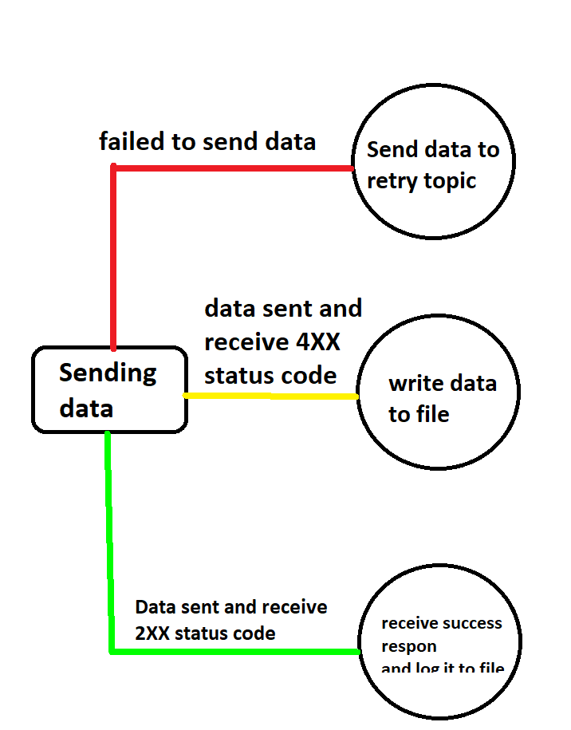

# Documentation

This repo use for sending data from kafka to specific destination using rest API.

Technology used for this repo :
- Java 8
- Spring Kafka
- Spring Web
- Broker Kafka

## Features

- Consume data from broker kafka
- Send consumed data from kafka to specific destination using rest API . 
- If data failed to sent , then data will send to kafka to retry Topic. Data in retry Topic will be sent again if PE ask for it. To send data , use stream-failed-pe application to do that. This application not cover that purpose.
- In almost all PE side, data can be saved to database , if and only if value date in data same as date of sending data. If mandiri give outdated data [data by date 2000] and PE just response it same as valid data then mandiri cannot track data that sent to PE. In that case, If data success to sent but PE must respond as invalid data [response code 4XX] , then data will write to file as invalid-data.
- Any activity to application, it will record in log files
- Monitoring data in C3 using MonitoringProducerInterceptor & MonitoringConsumerInterceptor
- Support Consumer Offset Translation to support FailOver scenario using ConsumerTimestampsInterceptor




## How to use

### Local
- Make sure your broker kafka is alive
- change destination broker kafka to your local or remote broker, example :
   ```sh
   kafka.consumer.broker=localhost:8080
   ```
- Set spring profiles for choose which environment that you want use . In intellij , use add VM options setting .
  example below for test environment
   ```sh
   -Dspring.profiles.active=test 
   ```

### Deploy to web application server [war]

- in maven terminal, bundle project to war file for production environment
   ```sh
   mvn clean package -P production
   ```
- in project directory, go to target folder and move war file to your web application service

# Note
Need cron job for cleaning data automatically for data log

# License

MIT

**Free Software, Hell Yeah!**


#REFERENSI

## Producer Config
- https://newrelic.com/blog/best-practices/kafka-best-practices
- https://strimzi.io/blog/2020/10/15/producer-tuning/
- https://www.confluent.io/blog/error-handling-patterns-in-kafka/
- if return null topic exception , create topic automatically using auto.create.topic config in broker configuration or just create topic manually

##ERROR HANDLING WHILE PRODUCING DATA
* https://serkansakinmaz.medium.com/error-handling-in-kafka-producer-edfc05bcbbbf
* https://stackoverflow.com/questions/61654578/kafka-producer-callback-exception

Note

Exception that can be throw while produce data already handling in retries config , so no need to handle it manually
so if non retries thrown , then it's not caused poison pill for application

##Producer not need to flush after produce data
Producer not need to flush after produce data because its can block next message for send to broker 
flush can be used for prevent data loss , if you call it , before you shutdown the producer
so if you just shutdown the service by force, than data loss can be happen 
but if you call flush programmatically , then data loss can not be happen
If you implement flush , you are effectively implementing a sync producer
(which you shouldn't, see here: https://github.com/edenhill/librdkafka/wiki/FAQ#why-is-there-no-sync-produce-interface).

##Testing block with no message loss
* https://jack-vanlightly.com/blog/2018/9/14/how-to-lose-messages-on-a-kafka-cluster-part1
* https://jack-vanlightly.com/blog/2018/9/18/how-to-lose-messages-on-a-kafka-cluster-part-2

## Consumer
* https://serkansakinmaz.medium.com/error-handling-in-kafka-consumer-27357a641c19
* https://strimzi.io/blog/2021/01/07/consumer-tuning/
